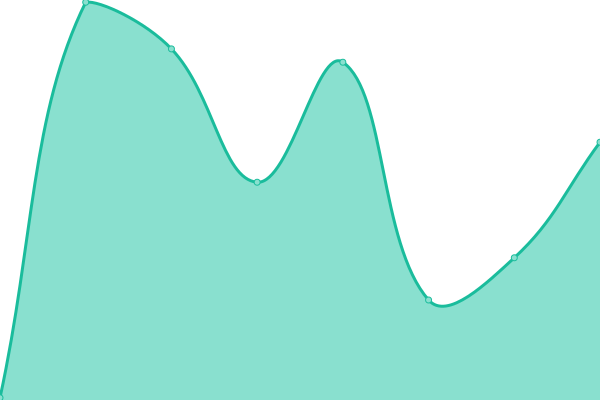

# [📈 Live Status](https://uptime.rua.dev): <!--live status--> **🟩 All systems operational**

This repository contains the open-source uptime monitor and status page for [Rua](https://uptime.rua.dev), powered by [Upptime](https://github.com/upptime/upptime).

With [Upptime](https://upptime.js.org), you can get your own unlimited and free uptime monitor and status page, powered entirely by a GitHub repository. We use [Issues](https://github.com/RuaDev/upptime/issues) as incident reports, [Actions](https://github.com/RuaDev/upptime/actions) as uptime monitors, and [Pages](https://uptime.rua.dev) for the status page.

<!--start: status pages-->
<!-- This summary is generated by Upptime (https://github.com/upptime/upptime) -->
<!-- Do not edit this manually, your changes will be overwritten -->
<!-- prettier-ignore -->
| URL | Status | History | Response Time | Uptime |
| --- | ------ | ------- | ------------- | ------ |
|  [Acme](https://acme.rua.dev) | 🟩 Up | [acme.yml](https://github.com/RuaDev/upptime/commits/HEAD/history/acme.yml) | 

 81ms
     
 | 

<a href="https://uptime.rua.dev/history/acme">100.00%</a>
    

|  [API](https://api.rua.dev) | 🟩 Up | [api.yml](https://github.com/RuaDev/upptime/commits/HEAD/history/api.yml) | 

 673ms
     
 | 

<a href="https://uptime.rua.dev/history/api">100.00%</a>
    

|  [DeepL X](https://deeplx.rua.dev) | 🟩 Up | [deep-l-x.yml](https://github.com/RuaDev/upptime/commits/HEAD/history/deep-l-x.yml) | 

 255ms
     
 | 

<a href="https://uptime.rua.dev/history/deep-l-x">100.00%</a>
    

|  [Google Gemini Reverse Proxy](https://gemini.rua.dev) | 🟩 Up | [google-gemini-reverse-proxy.yml](https://github.com/RuaDev/upptime/commits/HEAD/history/google-gemini-reverse-proxy.yml) | 

 142ms
     
 | 

<a href="https://uptime.rua.dev/history/google-gemini-reverse-proxy">100.00%</a>
    

|  [Note](https://note.rua.dev) | 🟩 Up | [note.yml](https://github.com/RuaDev/upptime/commits/HEAD/history/note.yml) | 

 86ms
     
 | 

<a href="https://uptime.rua.dev/history/note">100.00%</a>
    

|  [Paper Metadata Catch](https://pmd.rua.dev) | 🟩 Up | [paper-metadata-catch.yml](https://github.com/RuaDev/upptime/commits/HEAD/history/paper-metadata-catch.yml) | 

 198ms
     
 | 

<a href="https://uptime.rua.dev/history/paper-metadata-catch">100.00%</a>
    

<!--end: status pages-->

[**Visit our status website →**](https://uptime.rua.dev)

## 📄 License

- Powered by: [Upptime](https://github.com/upptime/upptime)
- Code: [MIT](./LICENSE) © [Anand Chowdhary](https://anandchowdhary.com), supported by [Pabio](https://pabio.com)
- Data in the `./history` directory: [Open Database License](https://opendatacommons.org/licenses/odbl/1-0/)
